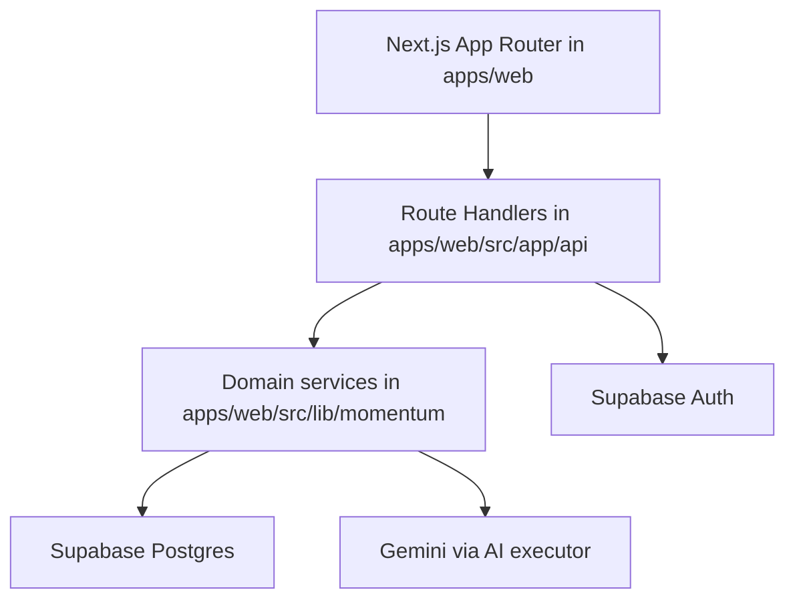

# Architecture

## Current product surface

The implemented product is a planning and execution workspace for:

- project portfolio management
- project task management
- daily planner views
- workspace and project execution scoring
- recovery planning
- goal simulation
- project timeline, decisions, and Ask Momentum
- AI-assisted task extraction, work breakdown, and briefing
- momentum flow / execution-plan generation

The older collaborative documents product is retired from the current codebase and database patches.

## Runtime architecture



## Main layers

### UI

Routes and pages live under `apps/web/src/app`.

Implemented user-facing pages:

- `/` execution home
- `/projects` portfolio list
- `/projects/[id]` project workspace
- `/planner` daily planner
- `/momentum` workspace execution intelligence
- `/login` auth entry point

### API

HTTP endpoints live under `apps/web/src/app/api`.

They are all Next.js route handlers and generally follow this pattern:

1. Validate the signed-in user with `requireSession`
2. Enforce project or task access via `authz.ts`
3. Delegate to a domain service under `src/lib/momentum`
4. Return JSON or a normalized error response

### Domain services

Core domain logic lives in `apps/web/src/lib/momentum`:

- `projects/` project CRUD and members
- `tasks/` task CRUD and validation
- `planner/` deterministic day planning
- `memory/` event journal, timeline, decisions, Ask Momentum
- `ai/` capability execution, prompt registry, run logging
- `scheduler/` execution-intelligence planning
- `recovery-service.ts`
- `simulation-service.ts`
- `execution-score.ts`
- `health-snapshot.ts`
- `risk-scorer.ts`

### Data

Supabase is the system of record for:

- auth and profile rows
- projects, members, and tasks
- project event journal
- recovery plans
- goal simulations
- AI run logs and citations
- momentum flow proposals and sessions
- capacity profiles

## Repository structure

```text
.
├─ apps/
│  ├─ web/                 # active Next.js product
│  └─ sync-server/         # leftover artifact, not an active workspace app
├─ docs/                   # current documentation
├─ supabase/
│  ├─ schema.sql
│  └─ patches/
├─ package.json            # root workspace scripts
└─ README.md
```

## Important implementation notes

### Auth and authorization

- Cookie-based session lookup happens in `src/lib/supabase/server.ts`.
- Server-side privileged queries use `src/lib/supabase/admin.ts`.
- Access control is enforced in `src/lib/momentum/authz.ts`.

Roles:

- `owner`
- `admin`
- `editor`
- `commenter`
- `viewer`

Current write paths mainly use:

- owner-only project mutation
- owner/admin member management
- owner/admin/editor task and recovery mutation
- member-readable timeline, intelligence, simulation, and score views

### Event-sourced project memory

Project and task mutations are not just plain table updates. The app also records project history through RPC-backed event journal functions in Supabase.

This powers:

- timeline views
- decisions with evidence
- Ask Momentum evidence selection
- AI citations tied to project activity

### AI architecture

AI routes use a shared executor pattern:

1. Build deterministic data first
2. Build a structured AI context
3. Attempt a model call
4. Fall back cleanly when AI is unavailable
5. Persist AI runs and citations when applicable

This means the product still returns usable results when the model is unavailable.

### Momentum flow naming split

The `momentum-flow` API name spans two implementations:

- `scheduler/execution-intelligence-service.ts` generates and reads the newer execution-plan style proposals
- `momentum-flow-service.ts` still owns proposal application and session updates against stored proposal/session tables

That split exists in the current code and is worth preserving when making future changes.
