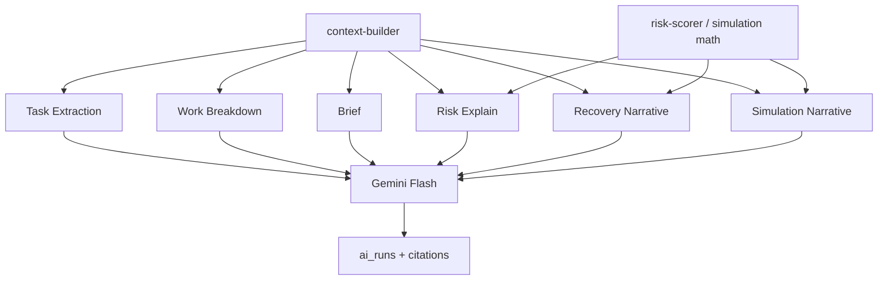

# Lumina — AI Architecture

> **Primary AI reference** for Momentum. Provider: **Google Gemini** (hackathon requirement).

---

## AI philosophy

| Principle | Implementation |
| --- | --- |
| Deterministic first | Scores, triggers, recovery actions from code |
| Propose, never silent mutate | `apply: false` default |
| Evidence over eloquence | `ai_runs` + `ai_run_citations` on every LLM call |
| Small context | Structured JSON; max ~6k tokens input |
| One gateway | `lib/momentum/ai/gateway.ts` — no multi-agent |
| Server-only | Route Handlers; never browser API keys |
| Fallback always | Template brief, factor bars without LLM |

---

## AI capability map



| Capability | Deterministic | LLM | Confirm |
| --- | --- | --- | --- |
| Task extraction | Dedupe, validate | Parse → tasks | Yes |
| Work breakdown | Parent links | Subtask titles | Yes |
| Blocker detection | Rules | Classify (defer) | N/A |
| Risk predictor | Score formula | Explain on demand | N/A |
| Recovery planner | Action list | Summary narrative | Apply |
| Goal simulation | Feasibility math | Narrative | N/A |
| Morning brief | Metrics, lists | 2–3 sentences | N/A |
| Execution insights | Score formula | Tips (defer) | N/A |

---

## Momentum Memory

### Purpose

Curated context—not a warehouse of `yjs_state`.

### Ingestion

| Source | Trigger | Stored as |
| --- | --- | --- |
| Onboarding availability chip | User | `preference` |
| User memory UI | User | `preference`, `goal` |
| Recovery applied | System | `recovery_note` |
| Brief generation | System | `context_summary` (TTL 30d) |
| Snooze patterns | System (defer) | `pattern` |
| Documents | Default | **Citation only** |
| Comments | Default | **Citation only** |

### Retrieval order

1. User-global memory (10 entries)  
2. Project memory (10 entries)  
3. Project goal + open tasks JSON  
4. Doc excerpts (2 docs × 2k chars, access-checked)  
5. Open comments (5 × 200 chars)  
6. Latest risk factors  

### Expiration

| kind | TTL |
| --- | --- |
| preference | None |
| goal | Until archived |
| pattern | 90d |
| recovery_note | 180d |
| context_summary | 30d |

### Ranking

`recency × kind_weight + pin_boost` → top N.

### Citations

Memory referenced in output → `ai_run_citations` type `memory_entry`.

---

## Task extraction

| | |
| --- | --- |
| **Purpose** | Propose tasks from text or document excerpt |
| **Inputs** | `project_id`, `source`, `text` or `document_id` + excerpt |
| **Outputs** | `proposals[]`, `ai_run_id`, `citations` |
| **Prompt** | JSON-only; existing task titles for dedupe |
| **Deterministic** | Access, dedupe, validate, apply on confirm |
| **LLM** | Extract actionable items |
| **Failure** | `502`; empty proposals OK |
| **Cost** | ~$0.001/call Flash |
| **Latency** | 2–5s |
| **MVP** | **Should** — paste text; defer live doc extract |

---

## Work breakdown

| | |
| --- | --- |
| **Purpose** | Subtasks for parent task |
| **Inputs** | `task_id`, `max_subtasks`, `apply` |
| **Outputs** | `proposals[]`, `ai_run_id` |
| **Context** | Parent title, project deadline, memory |
| **Deterministic** | Cap count, sort_order, apply |
| **LLM** | 3–7 subtask titles |
| **Failure** | Template fallback for demo |
| **Latency** | <2s |
| **MVP** | **Must** — onboarding step 4 |

---

## Risk predictor

### Deterministic scoring

```text
risk = w1×overdue + w2×deadline_pressure + w3×blocked
     + w4×load + w5×subtask_slippage
```

Persist `task_risk_scores` append-only.

### When to call AI

| Call LLM | Do NOT call |
| --- | --- |
| User taps “Why?” | Task list render |
| Score > 0.6 first time/day | Cron recompute |
| Brief (top 2 risks only) | All tasks low risk |

### Confidence

Based on estimates, velocity history, assignee presence.

### Explanation

2 sentences + citations to tasks/deps/memory.

**MVP:** **Must** deterministic; **Should** explain.

---

## Recovery planner

### Triggers

≥2 tasks high/critical OR health < 50 OR user manual OR simulation infeasible.

### Deterministic algorithm

1. Sort at-risk tasks  
2. Propose reschedule / deprioritize / breakdown / cancel low priority  
3. Cap 8 actions  
4. LLM polishes summary only  

### Application

User reviews → Apply → PATCH tasks → recompute risk → memory note.

**MVP:** **Must** — core demo arc (Sprint 6, after simulation).

---

## Goal simulation

### Question

“Can I still finish by June 29?”

### Inputs

Project deadline, open task estimates, capacity from memory (default 4h/day), velocity, scenario shifts.

### Logic

```text
remaining_minutes vs available_minutes until deadline
→ feasible, projected_completion, at_risk_task_ids, score_delta
```

### Narrative

LLM if confidence not high.

**Handoff:** `feasible: false` → **Build recovery plan**.

**MVP:** **Must** — before recovery in demo (Sprint 5).

---

## Morning brief

### Pipeline

1. **Deterministic:** overdue, due today, blocked, scores, top priorities  
2. **LLM (optional):** 2–3 sentence narrative with citations  
3. **Fallback template:** if Gemini off or rate limited  
4. **Cache:** 4h per user/date for demo  

**MVP:** **Must** — Sprint 3.

---

## Explainability

Every LLM response includes `ai_run_id`.

`GET /api/ai/runs/[id]`:

- capability, summaries, model, prompt_version  
- citations: document, task, comment, memory  

Deterministic features show `factors` JSON without run.

**MVP:** **Must**.

---

## Gemini strategy

| Topic | Choice |
| --- | --- |
| Provider | Google AI Studio / Gemini API |
| Model | `gemini-2.0-flash` (fallback `gemini-1.5-flash`) |
| Pro / thinking | Defer |
| JSON tasks | `responseMimeType: application/json` |
| Temperature | 0.2 structured, 0.4 narrative |
| Max output | 1024 tokens |
| Timeout | 25s |
| Env | `GEMINI_API_KEY` server-only |

### Context budgets

| Capability | Max input |
| --- | --- |
| Extract | 8k text + 1k context |
| Breakdown | 2k |
| Brief | 2k metrics JSON |
| Risk explain | 1k |
| Recovery narrative | 2k actions |
| Simulation | 1.5k results |

### Citation flow

Context tags sources → prompt requests `cited_sources[]` → server writes `ai_run_citations` with DB excerpts.

---

## Cost analysis

~**$0.002/active user/day** at Flash pricing.

| Tactic | Savings |
| --- | --- |
| Deterministic brief metrics | Always |
| Explain on tap only | High |
| 4h brief cache | Demo + prod |
| Cap excerpts | High |
| No embeddings | MVP |

Demo (10 judges × 20 actions): **< $1**.

---

## Latency analysis

| Path | Target |
| --- | --- |
| Risk recompute | <100ms |
| Brief deterministic | <300ms |
| Brief + narrative | <3s |
| Work breakdown | <2s |
| Recovery | <3s |
| Simulation math | <2s |

**UI:** Render metrics first; stream narrative async.

---

## MVP recommendations (AI)

### Must build

- Gemini gateway + run logger  
- Morning brief (deterministic + narrative)  
- Work breakdown (onboarding)  
- Explainability (`ai_runs`, citations)  
- Momentum memory (onboarding preference)  
- Deterministic risk + execution score + health  
- Risk “Why?” (optional LLM)  
- Goal simulation (math + narrative)  
- Recovery (deterministic actions + apply)  

### Should build

- Task extraction (paste)  
- Brief cache for demo  
- Recovery narrative via LLM  

### Can defer

- Blocker LLM classification  
- Embeddings / semantic memory  
- Pro model  
- Auto-learned patterns  
- LLM execution tips  
- Extract from live yjs doc  

---

## Related docs

| Doc | Purpose |
| --- | --- |
| [lumina-mvp-scope.md](lumina-mvp-scope.md) | Full product scope |
| [lumina-api-architecture.md](lumina-api-architecture.md) | Routes |

| [← UI](lumina-ui-architecture.md) | [Handbook](lumina-codex-handbook.md) | [MVP scope →](lumina-mvp-scope.md) |
