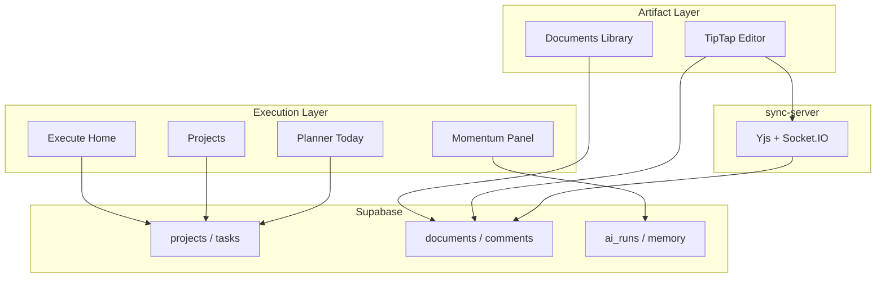
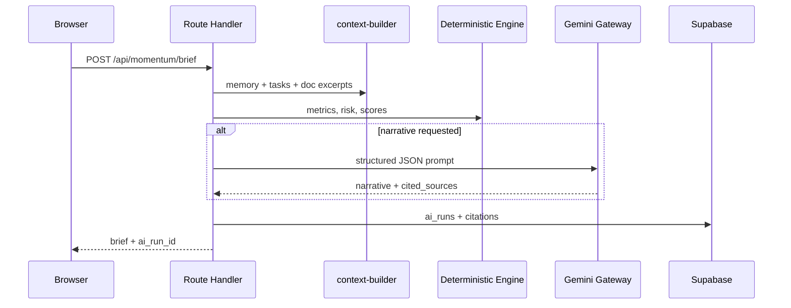

# Lumina — System Architecture

This document describes how **Lumina Write** evolves into **Lumina** without replacing the existing stack.

For the **current codebase snapshot**, see [lumina-write-existing-state.md](lumina-write-existing-state.md).  
For **runtime flows** of the existing editor, see [architecture.md](architecture.md).

---

## Executive summary

**Strategy:** Additive domain expansion—parallel **execution graph** (projects, tasks) alongside the **artifact graph** (documents). Keep Yjs/Socket.IO collab isolated. Run all AI in Next.js Route Handlers via Gemini.

```text
┌─────────────────────────────────────────────────────────────┐
│  apps/web (Next.js 14)                                      │
│  ├── Execute UI (Home, Projects, Planner today, Momentum)  │
│  ├── Documents UI + Editor (unchanged collab core)            │
│  └── /api/* Route Handlers → Supabase                       │
│       └── lib/momentum/* (authz, scoring, AI gateway)       │
├─────────────────────────────────────────────────────────────┤
│  apps/sync-server — FROZEN for Lumina v1                    │
│  Express + Socket.IO + Yjs persist only                     │
├─────────────────────────────────────────────────────────────┤
│  Supabase — Auth + Postgres + RLS                           │
└─────────────────────────────────────────────────────────────┘
```

---

## Existing Lumina Write architecture

### Monorepo

| App | Role |
| --- | --- |
| `apps/web` | Next.js 14 App Router, TipTap, REST APIs |
| `apps/sync-server` | Socket.IO + in-memory Yjs + batched `yjs_state` persist |
| `supabase/` | `schema.sql` + incremental `patches/` |

### Request boundaries

| Concern | Path |
| --- | --- |
| Auth | Supabase SSR cookies; `/auth/callback` |
| Document CRUD, share, comments, versions, access | `/api/documents/**` |
| Live body + presence | `useCollabEditor` → Socket.IO → `sync-server` |
| User search | `/api/users/search` |

See [api-overview.md](api-overview.md) and [sync-server-api.md](sync-server-api.md).

---

## Reusable systems

| Module | Location | Reuse for Lumina |
| --- | --- | --- |
| Supabase clients | `lib/supabase/*` | All new routes |
| API errors | `lib/api-route-errors.ts` | Consistent `{ error }` |
| HTTP helpers | `lib/http.ts` | Frontend fetch |
| Auth pattern | Document share/access routes | `lib/momentum/authz.ts` |
| RLS helpers | `is_document_member`, `is_document_owner` | Mirror for projects |
| UI shell | `page.tsx` patterns | Extract `AppShell` |
| User search | `/api/users/search` | Project member invite |
| Editor | `Editor.tsx`, comments, share, versions | Deliverable surface |

---

## Systems that must remain unchanged

| System | Files | Reason |
| --- | --- | --- |
| Yjs sync protocol | `apps/sync-server/src/index.ts` | Production collab |
| Yjs persistence | `apps/sync-server/src/yjsManager.ts` | Document durability |
| Sync auth | `apps/sync-server/src/auth.ts` | JWT + membership |
| Collab hook | `hooks/useCollabEditor.ts` | Socket lifecycle |
| Editor extensions | `components/editorExtensions.ts` | TipTap schema |
| Document API contracts | `app/api/documents/**` | Live users + editor |
| Document RLS | `schema.sql` document policies | Patch only additively |
| Auth flow | `login/`, `auth/callback/` | Session contract |
| Base64 Yjs | `lib/base64.ts` | Encoding contract |

### Surgical changes only

| System | Allowed change |
| --- | --- |
| `Editor.tsx` | Add menu entry for extract tasks; optional linked-tasks panel |
| `app/page.tsx` | Become Execute Home; docs move to `/documents` |
| `documents` table | Nullable `project_id` FK |

---

## Migration strategy

1. **Additive SQL patches** under `supabase/patches/`—never destructive re-run of `schema.sql` on production  
2. **New routes** under `/api/projects`, `/api/tasks`, `/api/momentum`, `/api/ai`, `/api/planner`  
3. **No Server Actions**, no Prisma/Drizzle  
4. **Documents** stay independent access-wise from projects (linking ≠ sharing)  
5. **AI** server-only in Route Handlers; Gemini via `GEMINI_API_KEY`  

---

## New systems required

### Execution domain

| System | Tables | APIs |
| --- | --- | --- |
| Projects | `projects`, `project_members` | `/api/projects/**` |
| Tasks | `tasks` | `/api/tasks/**`, `/api/projects/[id]/tasks` |
| Planner (read model) | — (queries `tasks`) | `/api/planner/today` |

### Intelligence domain

| System | Tables | APIs |
| --- | --- | --- |
| Momentum Memory | `momentum_memory_entries` | `/api/momentum/memory` |
| Risk | `task_risk_scores` | `/api/tasks/[id]/risk`, `/api/ai/predict-risk` |
| Health & execution score | `workspace_health_snapshots` | `/api/momentum/health`, `execution-score` |
| Recovery | `recovery_plans` | `/api/projects/[id]/recovery-plans`, `/api/ai/recovery-plan` |
| Simulation | `goal_simulations` | `/api/ai/simulate-goal` |
| AI audit | `ai_runs`, `ai_run_citations` | `/api/ai/runs/[id]` |
| Morning brief | — (assembled) | `/api/momentum/brief` |

---

## Workspace architecture



**User mental model:** Projects are commitments. Tasks are actions. Documents are outputs.

---

## Momentum architecture



Layer rules:

- **Deterministic:** risk score, execution score, health, simulation math, recovery actions  
- **LLM:** brief narrative, work breakdown, risk explain, recovery summary, simulation narrative  
- **Never on socket path:** no AI in `sync-server`  

Detail: [lumina-ai-architecture.md](lumina-ai-architecture.md).

---

## Deployment (unchanged)

| Piece | Host |
| --- | --- |
| Frontend | Vercel |
| Sync server | Render |
| Database + Auth | Supabase |

See [security-and-operations.md](security-and-operations.md).

---

## Related docs

| Doc | Purpose |
| --- | --- |
| [lumina-database-architecture.md](lumina-database-architecture.md) | Schema |
| [lumina-api-architecture.md](lumina-api-architecture.md) | Routes |
| [lumina-implementation-roadmap.md](lumina-implementation-roadmap.md) | Sprints |

| [← Vision](lumina-vision.md) | [Handbook](lumina-codex-handbook.md) | [Database →](lumina-database-architecture.md) |
