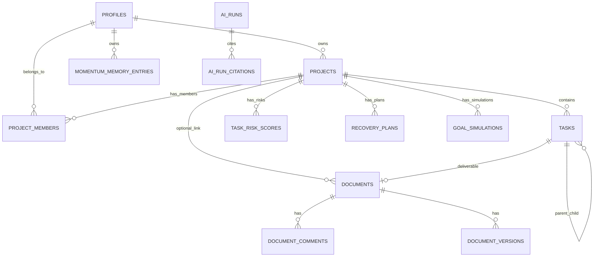

# Lumina — Database Architecture

> **No SQL in this document.** Implementation uses additive files under `supabase/patches/`.  
> Existing document schema: [data-model.md](data-model.md) and `supabase/schema.sql`.

---

## Overview

Lumina adds an **execution graph** alongside the existing **document graph**. Reuse `app_role` enum and `SECURITY DEFINER` RLS helper patterns from documents.

---

## MVP schema

Minimum for hackathon: **projects**, **project_members**, **tasks**, plus AI audit tables (Sprint 3).

### New enums (MVP)

| Enum | Values |
| --- | --- |
| `task_status` | `backlog`, `todo`, `in_progress`, `blocked`, `done`, `cancelled` |
| `task_priority` | `low`, `medium`, `high`, `urgent` |
| `project_status` | `active`, `paused`, `completed`, `archived` |
| `memory_kind` | `preference`, `pattern`, `goal`, `recovery_note`, `blocker_history`, `context_summary` |
| `memory_source` | `user`, `ai`, `system` |
| `ai_capability` | `extract_tasks`, `work_breakdown`, `blocker_detection`, `morning_brief`, `recovery_plan`, `goal_simulation`, `risk_explain` |
| `ai_run_status` | `pending`, `completed`, `failed`, `cancelled` |
| `citation_source_type` | `document`, `document_comment`, `document_version`, `task`, `project`, `memory_entry` |

Reuse existing: `app_role` on `project_members`.

### MVP tables

| Table | Sprint |
| --- | --- |
| `projects` | 1 |
| `project_members` | 1 |
| `tasks` | 1 |
| `momentum_memory_entries` | 3 |
| `ai_runs` | 3 |
| `ai_run_citations` | 3 |
| `task_risk_scores` | 4 |
| `workspace_health_snapshots` | 4 |
| `goal_simulations` | 5 |
| `recovery_plans` | 6 |

### Additive column on existing table

| Table | Column | Nullable | ON DELETE |
| --- | --- | --- | --- |
| `documents` | `project_id` → `projects` | Yes | SET NULL |

---

## Full schema

### `projects`

| Column | Type | Required | Notes |
| --- | --- | --- | --- |
| `id` | uuid PK | Yes | |
| `title` | text | Yes | 1–200 chars (app) |
| `description` | text | No | |
| `owner_id` | uuid → profiles | Yes | Canonical owner |
| `status` | project_status | Yes | Default `active` |
| `target_deadline` | timestamptz | No | |
| `goal_summary` | text | No | AI/simulation context |
| `execution_target_score` | smallint | No | 0–100 user goal |
| `created_at`, `updated_at` | timestamptz | Yes | |

### `project_members`

| Column | Type | Required | Notes |
| --- | --- | --- | --- |
| `id` | uuid PK | Yes | |
| `project_id` | uuid → projects | Yes | CASCADE |
| `user_id` | uuid → profiles | Yes | CASCADE |
| `role` | app_role | Yes | Default `viewer` |
| `created_at` | timestamptz | Yes | |
| Unique | `(project_id, user_id)` | | |

### `tasks`

| Column | Type | Required | Notes |
| --- | --- | --- | --- |
| `id` | uuid PK | Yes | |
| `project_id` | uuid → projects | Yes | CASCADE |
| `title` | text | Yes | |
| `description` | text | No | |
| `status` | task_status | Yes | Default `todo` |
| `priority` | task_priority | Yes | Default `medium` |
| `assignee_id` | uuid → profiles | No | SET NULL |
| `due_at`, `started_at`, `completed_at` | timestamptz | No | |
| `estimate_minutes`, `actual_minutes` | integer | No | |
| `parent_task_id` | uuid → tasks | No | SET NULL, WBS |
| `document_id` | uuid → documents | No | SET NULL, deliverable |
| `sort_order` | integer | Yes | Default 0 |
| `blocked_at`, `blocked_reason` | timestamptz, text | No | Quick flag |
| `created_by` | uuid → profiles | Yes | Audit |
| `created_at`, `updated_at` | timestamptz | Yes | |

### `momentum_memory_entries`

| Column | Type | Required | Notes |
| --- | --- | --- | --- |
| `id` | uuid PK | Yes | |
| `user_id` | uuid → profiles | Yes | CASCADE |
| `project_id` | uuid → projects | No | CASCADE; null = user-global |
| `kind` | memory_kind | Yes | |
| `source` | memory_source | Yes | |
| `title` | text | No | |
| `content` | text | Yes | Max ~8k (app) |
| `metadata` | jsonb | Yes | Default `{}`, refs |
| `confidence` | numeric(3,2) | No | 0–1 |
| `expires_at` | timestamptz | No | TTL |
| `supersedes_id` | uuid → self | No | Version chain |
| `created_at`, `updated_at` | timestamptz | Yes | |

### `ai_runs`

| Column | Type | Required | Notes |
| --- | --- | --- | --- |
| `id` | uuid PK | Yes | |
| `user_id` | uuid → profiles | Yes | |
| `project_id`, `task_id` | uuid | No | SET NULL |
| `capability` | ai_capability | Yes | |
| `status` | ai_run_status | Yes | |
| `model`, `prompt_version` | text | No | |
| `input_summary`, `output_summary` | text | No | Truncated |
| `input_tokens`, `output_tokens`, `latency_ms` | integer | No | |
| `error_message` | text | No | |
| `created_at`, `completed_at` | timestamptz | Yes | |

### `ai_run_citations`

| Column | Type | Required | Notes |
| --- | --- | --- | --- |
| `id` | uuid PK | Yes | |
| `ai_run_id` | uuid → ai_runs | Yes | CASCADE |
| `source_type` | citation_source_type | Yes | Polymorphic |
| `source_id` | uuid | Yes | No single FK |
| `excerpt` | text | No | Max ~500 chars |
| `metadata` | jsonb | Yes | Default `{}` |
| `sort_order` | integer | Yes | Default 0 |

### `task_risk_scores` (append-only)

| Column | Type | Required | Notes |
| --- | --- | --- | --- |
| `id` | uuid PK | Yes | |
| `task_id` | uuid → tasks | Yes | CASCADE |
| `project_id` | uuid → projects | Yes | Denormalized |
| `score` | numeric(4,3) | Yes | 0–1 |
| `risk_level` | text | Yes | low/medium/high/critical |
| `factors` | jsonb | Yes | Deterministic breakdown |
| `computed_by` | memory_source | Yes | Default `system` |
| `ai_run_id` | uuid → ai_runs | No | If explained |
| `computed_at` | timestamptz | Yes | |

### `workspace_health_snapshots` (append-only)

| Column | Type | Required | Notes |
| --- | --- | --- | --- |
| `id` | uuid PK | Yes | |
| `scope` | text | Yes | `user` \| `project` |
| `user_id` | uuid → profiles | Yes | |
| `project_id` | uuid → projects | No | Null = user-wide |
| `health_score` | smallint | Yes | 0–100 |
| `execution_score` | smallint | Yes | 0–100 |
| `metrics` | jsonb | Yes | |
| `computed_at` | timestamptz | Yes | |

### `goal_simulations`

| Column | Type | Required | Notes |
| --- | --- | --- | --- |
| `id` | uuid PK | Yes | |
| `project_id` | uuid → projects | Yes | CASCADE |
| `name` | text | No | |
| `inputs`, `outputs` | jsonb | Yes | |
| `ai_run_id` | uuid | No | |
| `created_by` | uuid → profiles | Yes | |
| `created_at` | timestamptz | Yes | |

### `recovery_plans`

| Column | Type | Required | Notes |
| --- | --- | --- | --- |
| `id` | uuid PK | Yes | |
| `project_id` | uuid → projects | Yes | CASCADE |
| `triggered_by` | text | Yes | risk_threshold, user, ai, blocker |
| `status` | text | Yes | draft, active, applied, dismissed, superseded |
| `summary` | text | No | |
| `plan` | jsonb | Yes | Action list |
| `ai_run_id` | uuid | No | |
| `created_by` | uuid → profiles | Yes | |
| `applied_at` | timestamptz | No | |
| `created_at`, `updated_at` | timestamptz | Yes | |

---

## Deferred tables

| Table | Reason |
| --- | --- |
| `task_dependencies` | Rules-based blockers sufficient for MVP |
| `project_access_requests` | Owner-invite only in v1 |
| `task_document_links` | Use `tasks.document_id` + `documents.project_id` |
| `ai_run_payloads` | Summaries only in v1 |

---

## Relationships

**Linking rules:**

- `documents.project_id` — optional; does **not** grant doc access to project members  
- `tasks.document_id` — optional deliverable; one primary doc per task in v1  

---

## Ownership model

| Entity | Owner |
| --- | --- |
| Project | `projects.owner_id` |
| Project roster | Owner/admin manages via `project_members` |
| Task | Project-scoped; `created_by` is audit only |
| Document | `documents.owner_id` (unchanged) |
| Memory | `user_id`; project-scoped readable by members |
| AI runs | Triggering user; project members may read project-scoped runs |
| Risk/health snapshots | System-written; members read |

---

## RLS strategy

### SECURITY DEFINER helpers (new)

| Function | Purpose |
| --- | --- |
| `is_project_member(project_id)` | Break recursion |
| `is_project_owner(project_id)` | Owner checks |
| `has_project_write_role(project_id)` | owner, admin, editor |
| `has_project_admin_role(project_id)` | owner, admin |
| `can_read_ai_run(run_id)` | Citation visibility |

### Policy summary

| Table | SELECT | INSERT/UPDATE | DELETE |
| --- | --- | --- | --- |
| `projects` | owner ∨ member | insert owner; update owner | owner |
| `project_members` | member | owner/admin | owner/admin ∨ self |
| `tasks` | member | write role | owner/admin |
| `momentum_memory_entries` | owner ∨ project member | own user_id | own |
| `task_risk_scores` | member | service/system only | — |
| `workspace_health_snapshots` | own user ∨ project member | service only | — |
| `ai_runs` | triggerer ∨ project member | authenticated user | — |
| `ai_run_citations` | via `can_read_ai_run` | with parent run | — |
| `recovery_plans` | member | write/admin | owner |
| `goal_simulations` | member | write role | creator ∨ owner |
| `documents` | *(existing)* | *(existing)* | *(existing)* |

`documents.project_id` update: document owner only.

---

## Migration order

Apply in Supabase SQL Editor **in order**. Never re-run destructive `schema.sql` on production.

| Order | Patch file | Sprint |
| --- | --- | --- |
| 1 | `add_project_enums.sql` | 1 |
| 2 | `add_project_rls_helpers.sql` | 1 |
| 3 | `add_projects.sql` | 1 |
| 4 | `add_project_members.sql` | 1 |
| 5 | `add_tasks.sql` | 1 |
| 6 | `add_documents_project_id.sql` | 2 (optional) |
| 7 | `add_memory_enums.sql` | 3 |
| 8 | `add_momentum_memory_entries.sql` | 3 |
| 9 | `add_ai_enums.sql` | 3 |
| 10 | `add_ai_runs.sql` | 3 |
| 11 | `add_ai_run_citations.sql` | 3 |
| 12 | `add_task_risk_scores.sql` | 4 |
| 13 | `add_workspace_health_snapshots.sql` | 4 |
| 14 | `add_goal_simulations.sql` | 5 |
| 15 | `add_recovery_enums.sql` | 6 |
| 16 | `add_recovery_plans.sql` | 6 |

After hackathon: fold patches into `schema.sql` for greenfield installs only.

---

## Related docs

| Doc | Purpose |
| --- | --- |
| [data-model.md](data-model.md) | Document roles |
| [lumina-api-architecture.md](lumina-api-architecture.md) | API access patterns |

| [← Architecture](lumina-architecture.md) | [Handbook](lumina-codex-handbook.md) | [API →](lumina-api-architecture.md) |
