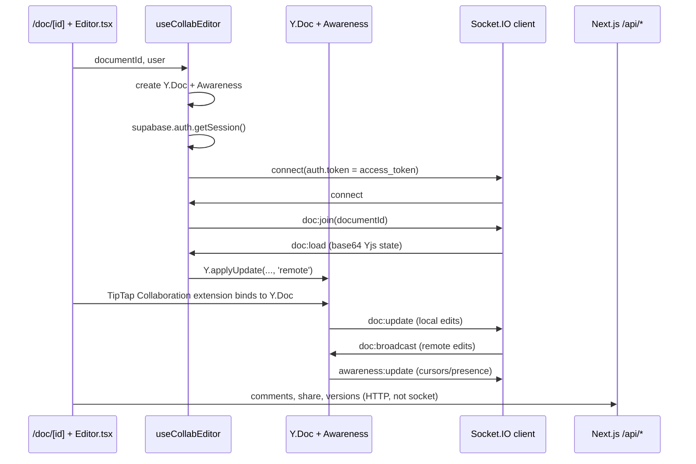
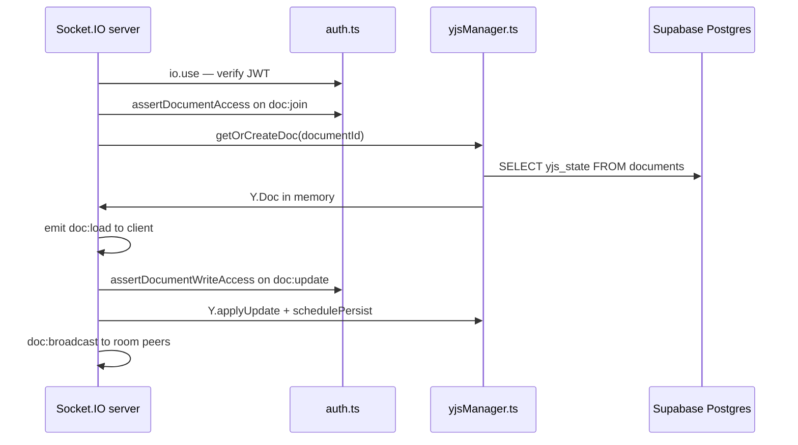

# Lumina Write — Existing State Overview

> **Note:** This document is a **pre-Lumina implementation snapshot**. For approved evolution plans, start at [lumina-codex-handbook.md](lumina-codex-handbook.md).

> Generated from the current codebase (`google-docs-clone` monorepo).  
> **Live app:** https://lumina-write-editor.vercel.app/

---

## 1. Project Structure

### Monorepo layout

```text
.
├── package.json                 # npm workspaces root (apps/*)
├── vercel.json                  # Vercel deploy config (Next.js)
├── .env.example                 # Shared env template
├── README.md
├── docs/                        # Technical handbook
├── supabase/
│   ├── schema.sql               # Full Postgres schema (source of truth)
│   └── patches/                 # Incremental SQL migrations
└── apps/
    ├── web/                     # Next.js 14 frontend + API routes
    └── sync-server/             # Express + Socket.IO + Yjs persistence
```

### `apps/web/src/` — tree (depth 4)

```text
apps/web/src/
├── app/                         # Next.js App Router (NOT Pages Router)
│   ├── layout.tsx
│   ├── page.tsx                 # Dashboard (home)
│   ├── globals.css
│   ├── not-found.tsx
│   ├── login/page.tsx
│   ├── doc/
│   │   ├── page.tsx
│   │   └── [id]/page.tsx        # Editor shell
│   ├── auth/callback/route.ts   # OAuth code exchange
│   └── api/                     # Route Handlers (REST)
│       ├── documents/
│       │   ├── route.ts
│       │   └── [id]/
│       │       ├── access/route.ts
│       │       ├── comments/route.ts
│       │       ├── share/route.ts
│       │       └── versions/route.ts
│       └── users/search/route.ts
├── components/
│   ├── Editor.tsx
│   ├── CommentsPanel.tsx
│   ├── ShareModal.tsx
│   ├── VersionHistoryPanel.tsx
│   ├── PresenceBar.tsx
│   ├── LoginButton.tsx
│   ├── ThemeProvider.tsx
│   ├── editorExtensions.ts
│   └── ui/                      # shadcn-style primitives
│       ├── button.tsx
│       └── avatar.tsx
├── hooks/
│   └── useCollabEditor.ts       # Yjs + Socket.IO client
└── lib/
    ├── supabase/
    │   ├── client.ts
    │   ├── server.ts
    │   └── admin.ts
    ├── http.ts
    ├── base64.ts
    ├── cursorColors.ts
    ├── notify.ts
    └── utils.ts
```

### Folder notes

| Path | Exists? | Notes |
| --- | --- | --- |
| `src/` | ✅ | Under `apps/web/src/` only |
| `app/` | ✅ | App Router (`apps/web/src/app/`) |
| `components/` | ✅ | `apps/web/src/components/` |
| `lib/` | ✅ | `apps/web/src/lib/` |
| `hooks/` | ✅ | `apps/web/src/hooks/` (single hook today) |
| `types/` | ❌ | No dedicated types folder; types are inline in components and API routes |

### Router & organization

| Question | Answer |
| --- | --- |
| **Next.js App Router?** | **Yes** — `apps/web/src/app/` |
| **Pages Router?** | **No** — no `pages/` directory |
| **Folder organization** | Feature routes in `app/`, UI in `components/`, Supabase + helpers in `lib/`, collab hook in `hooks/` |
| **Existing modules** | `web` (Next.js), `sync-server` (Express/Socket.IO) |

---

## 2. Tech Stack

### Frontend (`apps/web`)

| Technology | Version / status |
| --- | --- |
| **Next.js** | `14.2.35` |
| **React** | `^18` (root override: `^18.3.1`) |
| **TypeScript** | `^5` |
| **Tailwind CSS** | `^3.4.1` (+ `@tailwindcss/typography`, `tailwindcss-animate`) |
| **shadcn/ui** | Configured (`components.json`, style `base-nova`); only `button` + `avatar` installed so far |
| **TipTap** | `^3.20.4` (ProseMirror-based editor) |
| **Yjs** | `^13.6.30` |
| **Socket.IO client** | `^4.8.3` |
| **State** | React `useState` / `useEffect` (Zustand is in `package.json` but **not used** in `src/` yet) |
| **Icons** | `lucide-react` |
| **Toasts** | `react-hot-toast` |

### Backend

| Layer | Technology | Notes |
| --- | --- | --- |
| **Web API** | **Next.js Route Handlers** | `apps/web/src/app/api/**/route.ts` |
| **Server Actions** | **None** | No `"use server"` in codebase |
| **Realtime server** | **Node + Express 5 + Socket.IO 4** | `apps/sync-server/` |
| **Auth verification (sync)** | Supabase JWT via `auth.getUser(token)` | `apps/sync-server/src/auth.ts` |

### Database

| Technology | Status |
| --- | --- |
| **Supabase** | ✅ Auth + Postgres + RLS |
| **PostgreSQL** | ✅ Via Supabase |
| **Prisma** | ❌ Not used |
| **Drizzle** | ❌ Not used |
| **Raw SQL** | ✅ `supabase/schema.sql` + patches; app uses `@supabase/supabase-js` client |

---

## 3. Current Features

Exact status from implemented code and schema:

| Feature | Status | Details |
| --- | --- | --- |
| **Auth** | ✅ | Supabase Auth: Google OAuth + email/password sign-up/sign-in |
| **Documents** | ✅ | Create, list, rename, delete; dashboard with grid/list |
| **Collaborative editing** | ✅ | TipTap + Yjs + Socket.IO |
| **Yjs** | ✅ | Client `Y.Doc` + server in-memory docs + DB `yjs_state` |
| **Socket.IO** | ✅ | Dedicated `apps/sync-server` |
| **Comments** | ✅ | CRUD + resolve; role-gated (`document_comments` table) |
| **Sharing** | ✅ | Invite by email, role assignment (`ShareModal` + `/api/.../share`) |
| **Roles** | ✅ | `viewer`, `commenter`, `editor`, `admin`, `owner` |
| **Version history** | ✅ | Yjs snapshots in `document_versions` (max ~20 per doc on server) |
| **Access requests** | ✅ | Non-members request access; owner/admin approve/reject |
| **Presence / cursors** | ✅ | Yjs Awareness + `PresenceBar` |
| **Templates (UI)** | ⚠️ Partial | Dashboard template cards create docs with preset titles; some seed HTML in editor — **not** a `templates` DB table |
| **Trash** | ⚠️ Partial | **Client-only** (`localStorage`); not persisted in Postgres |
| **Notifications** | ⚠️ Partial | Dashboard bell shows shared docs; editor bell shows access requests for owner/admin |
| **Tasks** | ❌ | No tables, routes, or UI |
| **Projects** | ❌ | No project entity (only a “Project Plan” template label) |
| **Planner** | ❌ | Not implemented |
| **AI (in-app)** | ❌ | No Gemini/OpenAI/Anthropic API integration in app code |

---

## 4. Database Schema

**Source of truth:** `supabase/schema.sql` (run in Supabase SQL Editor for new projects).

### Tables

#### `profiles`
| Column | Type | Notes |
| --- | --- | --- |
| `id` | `uuid` PK | FK → `auth.users` |
| `email` | `text` | |
| `full_name` | `text` | |
| `avatar_url` | `text` | |
| `color` | `text` | Default `#3B82F6` |

Auto-created on sign-up via trigger `handle_new_user()`.

#### `documents`
| Column | Type | Notes |
| --- | --- | --- |
| `id` | `uuid` PK | |
| `title` | `text` | Default `'Untitled Document'` |
| `yjs_state` | `text` | Base64-encoded Yjs binary state |
| `owner_id` | `uuid` FK → `profiles` | |
| `created_at` | `timestamptz` | |
| `updated_at` | `timestamptz` | |

#### `document_members`
| Column | Type | Notes |
| --- | --- | --- |
| `id` | `uuid` PK | |
| `document_id` | `uuid` FK → `documents` | |
| `user_id` | `uuid` FK → `profiles` | |
| `role` | `app_role` enum | `viewer` \| `commenter` \| `editor` \| `admin` \| `owner` |
| `created_at` | `timestamptz` | |
| | | Unique `(document_id, user_id)` |

#### `document_versions`
| Column | Type | Notes |
| --- | --- | --- |
| `id` | `uuid` PK | |
| `document_id` | `uuid` FK | |
| `yjs_state` | `text` | Full Yjs snapshot (base64) |
| `created_by` | `uuid` FK → `profiles` | |
| `label` | `text` | Default `'Auto-save'` |
| `created_at` | `timestamptz` | |

#### `document_comments`
| Column | Type | Notes |
| --- | --- | --- |
| `id` | `uuid` PK | |
| `document_id` | `uuid` FK | |
| `user_id` | `uuid` FK | |
| `content` | `text` | 1–2000 chars |
| `selection_text` | `text` | Optional anchor text |
| `status` | `text` | `'open'` \| `'resolved'` |
| `resolved_at` | `timestamptz` | |
| `resolved_by` | `uuid` FK | |
| `created_at` / `updated_at` | `timestamptz` | |

#### `document_access_requests`
| Column | Type | Notes |
| --- | --- | --- |
| `id` | `uuid` PK | |
| `document_id` | `uuid` FK | |
| `user_id` | `uuid` FK | |
| `requested_role` | `app_role` | |
| `status` | `text` | `'pending'` \| `'approved'` \| `'rejected'` |
| `created_at` | `timestamptz` | |

### RLS helpers (Postgres functions)

- `is_document_member(doc_id uuid)` — SECURITY DEFINER
- `is_document_owner(doc_id uuid)` — SECURITY DEFINER

### What can be reused vs what needs migration

| Reuse as-is | Needs new schema / migration |
| --- | --- |
| `profiles` + Supabase Auth | `tasks`, `projects`, `planner` entities |
| `documents` + `yjs_state` collab model | Server-side **trash** / soft-delete |
| `document_members` + `app_role` | `templates` table (if templates become first-class) |
| `document_comments` | AI chat / prompt history tables |
| `document_versions` | Workspace / org / team hierarchy |
| `document_access_requests` | Billing, usage metering |
| RLS patterns + SECURITY DEFINER helpers | Any feature requiring new RLS policies |

**Patches** (existing DBs): `supabase/patches/` — e.g. `ensure_app_role_admin.sql`, `add_document_comments.sql`.

---

## 5. Authentication

| Method | Status |
| --- | --- |
| **Supabase Auth** | ✅ Primary auth system |
| **Google OAuth** | ✅ `signInWithOAuth({ provider: 'google' })` → `/auth/callback` |
| **Email + password** | ✅ Sign in and sign up on `/login` |
| **Email OTP / magic link** | ❌ Not implemented in UI |
| **Custom JWT issuance** | ❌ App uses **Supabase session JWT** (`access_token`) |
| **JWT usage** | ✅ Passed to Socket.IO as `auth.token`; verified server-side |

### Auth flow

1. User signs in on `/login` (password or Google).
2. OAuth returns to `/auth/callback` → `exchangeCodeForSession`.
3. Session stored in cookies via `@supabase/ssr` (`lib/supabase/client.ts`, `server.ts`).
4. API routes read session with `createClient()` from `lib/supabase/server.ts`.
5. Sync server validates `access_token` with service-role `auth.getUser()`.

**Note:** No Next.js `middleware.ts` — protected routes redirect client-side (e.g. dashboard checks `getUser()` and sends to `/login`).

---

## 6. Existing AI Integration

| Provider | In-app integration |
| --- | --- |
| **Gemini API** | ❌ None |
| **OpenAI API** | ❌ None |
| **Anthropic API** | ❌ None |

AI tools were used **during development** (planning, design, implementation) per `docs/security-and-operations.md` — but there is **no runtime AI feature** in the application.

---

## 7. Existing UI Screens

> **Screenshots:** This document cannot embed live screenshots. View the deployed app or run locally:
>
> - **Production:** https://lumina-write-editor.vercel.app/
> - **Local:** `npm run dev:web` → http://localhost:3000

### Screen inventory

| Screen | Route | Key UI |
| --- | --- | --- |
| **Login / Sign up** | `/login` | Split hero + auth card; email/password tabs; Google button; warm cream/brown Lumina brand |
| **Dashboard (Home)** | `/` | Collapsible sidebar (Home, Documents, Templates, Shared, Trash); search; Recent/Shared/Drafts tabs; template carousel; document grid/list; stats hero; mobile bottom nav + FAB |
| **Editor** | `/doc/[id]` | Full-screen TipTap editor; formatting toolbar; presence bar; Share modal; Comments panel; Version history; outline sidebar; access-request notifications (owner/admin) |
| **Sidebar** | Part of `/` | Lumina logo, nav items, account menu with sign out |
| **Navigation** | `/` header + mobile nav | Search, tabs, notifications bell, “New Document” |

### Visual design system

- **Palette:** Warm neutrals (`#f7f3ec`, `#9a5b2b`, `#1f2937`), Google-blue accents on actions
- **Typography:** Inter (UI), Newsreader (headlines), Space Grotesk / Manrope (CSS vars)
- **Theme:** `ThemeProvider` + `data-theme="dark"` on `<html>`; single subtle theme (not a full light/dark toggle product)
- **Brand assets:** `apps/web/public/brand/` (logo, google.svg, file-text.svg)

### How to capture screenshots

1. Open https://lumina-write-editor.vercel.app/login (unauthenticated).
2. Sign in → capture Dashboard (`/`).
3. Open any document → capture Editor (`/doc/[id]`).
4. Open Share, Comments, Version History panels in the editor for sidebar/modal shots.

---

## 8. Realtime Architecture

### Stack

```
TipTap (ProseMirror) ↔ Y.Doc ↔ Socket.IO ↔ Express sync-server ↔ Supabase (documents.yjs_state)
```

### Frontend flow



**Key files**

- `apps/web/src/hooks/useCollabEditor.ts` — socket lifecycle, Yjs sync, presence
- `apps/web/src/components/Editor.tsx` — TipTap setup, Collaboration + CollaborationCursor
- `apps/web/src/components/editorExtensions.ts` — underline, link, image blocks, text style

### Backend flow



**Key files**

- `apps/sync-server/src/index.ts` — Express, Socket.IO events, room logic
- `apps/sync-server/src/auth.ts` — JWT + membership/role checks
- `apps/sync-server/src/yjsManager.ts` — in-memory `Map` of Y.Docs, 2s batched persist

### Persistence flow

| Step | Behavior |
| --- | --- |
| **Load** | On `doc:join`, server loads `documents.yjs_state` (base64) into in-memory `Y.Doc` |
| **Live sync** | Updates broadcast via `doc:broadcast`; not written to DB on every keystroke |
| **Auto-save** | `schedulePersist` debounces **2 seconds**, writes `yjs_state` + `updated_at` via **service role** |
| **Manual versions** | `POST /api/documents/[id]/versions` inserts `document_versions` row; server trims to ~20 versions |
| **Comments / shares** | REST only — **not** on the Yjs socket path |

### Role enforcement (realtime)

| Role | Live edit (`doc:update`) | Presence (`awareness:update`) |
| --- | --- | --- |
| owner, admin, editor | ✅ | ✅ |
| commenter, viewer | ❌ (read-only sync) | ✅ |

Rejected clients receive `doc:rejected` with reason codes (`access_denied`, `write_forbidden`, etc.).

---

## 9. Deployment

| Service | Host | Config |
| --- | --- | --- |
| **Frontend** | **Vercel** | `vercel.json` (`"framework": "nextjs"`); live URL: https://lumina-write-editor.vercel.app/ |
| **Sync server** | **Render** (documented target) | `NEXT_PUBLIC_SYNC_SERVER_URL` in web env; `CLIENT_URL` CORS on sync server |
| **Database + Auth** | **Supabase** | `NEXT_PUBLIC_SUPABASE_URL`, anon key (client), service key (server only) |
| **Railway** | Not used | Mentioned only as alternative in `.env.example` comments |

### Environment variables (summary)

**`apps/web/.env.local`**

- `NEXT_PUBLIC_SUPABASE_URL`
- `NEXT_PUBLIC_SUPABASE_ANON_KEY`
- `NEXT_PUBLIC_SYNC_SERVER_URL`

**`apps/sync-server/.env`**

- `SUPABASE_URL`
- `SUPABASE_SERVICE_KEY`
- `CLIENT_URL` (comma-separated Vercel origins)
- `PORT` (default `4000`)

### Local development

```bash
npm install
cp .env.example apps/web/.env.local
cp .env.example apps/sync-server/.env
# Run supabase/schema.sql on Supabase project
npm run dev:server   # sync-server :4000
npm run dev:web      # Next.js :3000
```

---

## Quick reference — REST API routes

| Route | Methods |
| --- | --- |
| `/api/documents` | GET, POST |
| `/api/documents/[id]/access` | GET, POST, PATCH |
| `/api/documents/[id]/share` | GET, POST, PATCH, DELETE |
| `/api/documents/[id]/versions` | GET, POST |
| `/api/documents/[id]/comments` | GET, POST, PATCH, DELETE |
| `/api/users/search` | GET |

See `docs/rest-api-reference.md` for request/response contracts.

---

## Related docs

| Doc | Purpose |
| --- | --- |
| [architecture.md](architecture.md) | Flows and diagrams |
| [data-model.md](data-model.md) | Role matrix |
| [api-overview.md](api-overview.md) | HTTP + Socket cheat sheet |
| [sync-server-api.md](sync-server-api.md) | Socket event reference |
| [getting-started.md](getting-started.md) | Setup |
| [security-and-operations.md](security-and-operations.md) | Hosting and security |
